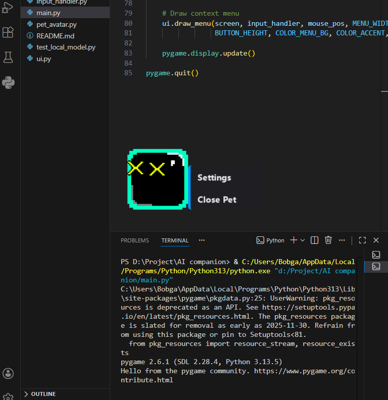
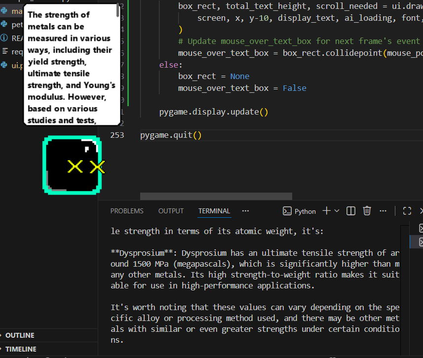

# AI Companion

## Overview
This project is an experimental AI companion designed to explore how autonomous software agents can visually interact with a desktop environment. The companion is intended to move around the screen, observe a user-defined region, and provide assistance based on on-screen context.

The main goal of this project is to learn about interactive system design, basic AI decision-making, and real-time visual interaction, inspired by the concept of a J.A.R.V.I.S.-style desktop assistant.

## Current Progress
- Basic avatar rendering and movement behavior
- Initial UI layout and helper components
- Input handling structure for future interaction
- Early experimentation with local AI models
- Initial sprite and visual asset setup

## Planned Features
- User-selected screen regions and bounding box controls
- Visual context capture and basic on-screen analysis
- Lightweight local inference for contextual understanding
- Interaction layer for suggestions and assistance
- Simple personalization and habit-learning experiments
- Configurable avatar behavior and visual themes




## Project Structure
- `main.py` — Application entry point and main loop
- `pet_avatar.py` — Avatar rendering and behavior logic
- `input_handler.py` — Input and event handling
- `ui.py` — UI components and layout helpers
- `test_local_model.py` — Local model experimentation
- `images/` — Sprite and visual assets

## What I Learned
- Structuring a real-time Python application
- Managing rendering loops and input handling
- Designing modular components for future expansion
- Experimenting with early-stage AI integration
- Translating high-level ideas into incremental technical steps

## Future Development
This project is still in active development. Future work will focus on improving contextual understanding, refining interaction logic, and experimenting with simple personalization techniques to better support user workflows.

## How to Run
1. Ensure Python is installed.
2. Install required dependencies as they are introduced.
3. Run the application:
   ```bash
   python main.py
   
## Notes
This project is a personal learning initiative and serves as a sandbox for exploring AI-driven interactive systems.
